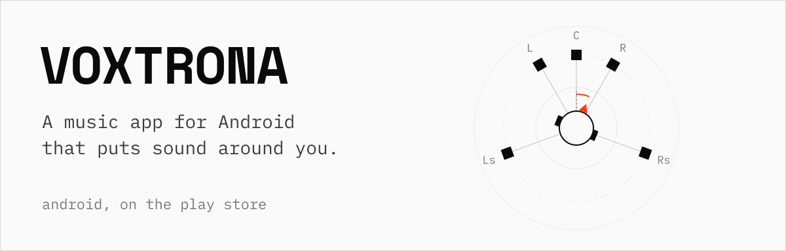
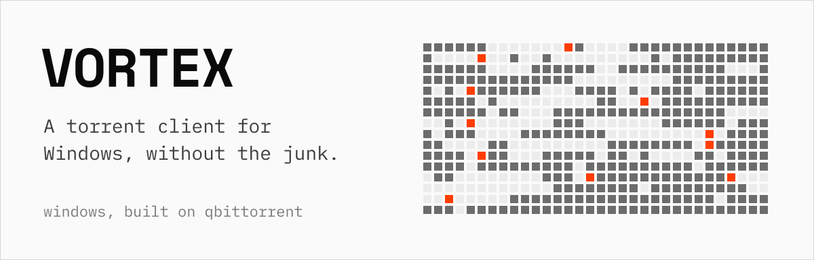
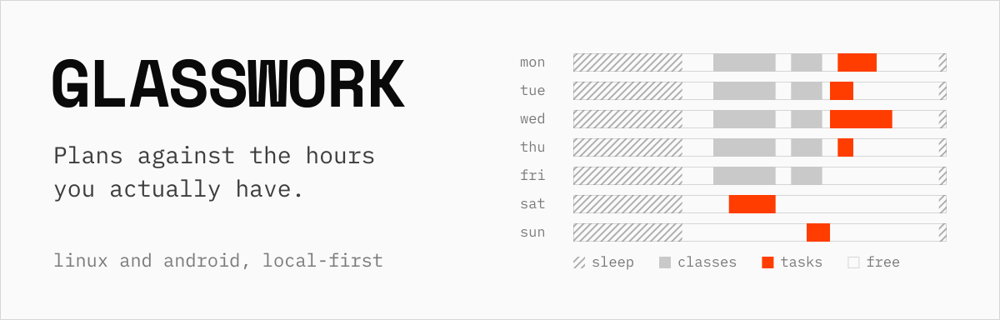

<p>
  <picture>
    <source media="(prefers-color-scheme: dark)" srcset="assets/header-dark.svg">
    
  </picture>
</p>

I'm a third-year CS (Data Science) student at Sikkim Manipal Institute of Technology, and most of what I build ends up in other people's hands: a music app on the Play Store, a torrent client for Windows, and a task planner I use every day. The parts I enjoy most are the ones nobody sees. Sync that never loses an edit, a crossfade that waits for the silence, a client that stays under 30 MB of RAM.

[souvikbagchi.in](https://www.souvikbagchi.in/) &ensp;/&ensp; [LinkedIn](https://www.linkedin.com/in/bagchisouvik/) &ensp;/&ensp; [X](https://x.com/mrhyperion101) &ensp;/&ensp; [Instagram](https://www.instagram.com/mrhyperion) &ensp;/&ensp; [souvikbagchi.dev@gmail.com](mailto:souvikbagchi.dev@gmail.com)

<br>

<p>
  <a href="https://voxtrona.in/">
    <picture>
      <source media="(prefers-color-scheme: dark)" srcset="assets/voxtrona-dark.svg">
      
    </picture>
  </a>
</p>

Version 4.0 does spatial audio properly. Stereo gets up-mixed to a virtual 5.1 bed and rendered binaurally, with five profiles, optional head tracking from the front camera and a face scan to fit the HRTF. Around that sit a 10-band EQ, DJ crossfades that detect the silence between tracks, and 25 languages including right-to-left. Dolby came on as title partner, and it has 5,000+ active users. Kotlin and Jetpack Compose on ExoPlayer, Clean Architecture with MVVM.

**[voxtrona.in](https://voxtrona.in/)**

<br>

<p>
  <a href="https://www.vortexproject.in/">
    <picture>
      <source media="(prefers-color-scheme: dark)" srcset="assets/vortex-dark.svg">
      
    </picture>
  </a>
</p>

A fork of qBittorrent that keeps its libtorrent core and drops the clutter other clients pile on: no ads, no bundled miners, no tracking, and under 30 MB of memory at full load. Traffic can be bound to a VPN interface, RSS feeds download on regex rules, and a web UI over HTTPS runs the whole thing from another machine. C++ on libtorrent. The site is Next.js 15 with React Three Fiber and GSAP.

**[vortexproject.in](https://www.vortexproject.in/)**

<br>

<p>
  <a href="https://github.com/MrHyperIon101/glasswork">
    <picture>
      <source media="(prefers-color-scheme: dark)" srcset="assets/glasswork-dark.svg">
      
    </picture>
  </a>
</p>

It knows when you sleep, what your week already holds and how long your work takes, so it tells you what's genuinely left while you're adding a task, not the night before it's due. Local-first on Linux and Android: every write lands in SQLite first, and optional sync through your own Supabase project merges field by field, ordered by a hybrid logical clock. 779 tests hold the design in place, including one that fails if anything writes around the sync layer. Flutter and Dart, with the Linux runner and tray written in C against GTK. MIT licensed.

**[Source](https://github.com/MrHyperIon101/glasswork)** &ensp;/&ensp; **[Releases](https://github.com/MrHyperIon101/glasswork/releases)**

<br>

```
$ cat ~/stack
kotlin, jetpack compose, flutter, dart
typescript, next.js, react
python, scikit-learn, xgboost
c, c++, java
postgres, supabase, sqlite, firebase
gcp, aws, cloudflare
```

Right now I'm looking for an on-site software engineering internship, and I'm happy to relocate for the right one. I'm also an IBM Z Student Ambassador, and was Campus Lead for Open Source Connect Global 2026.
